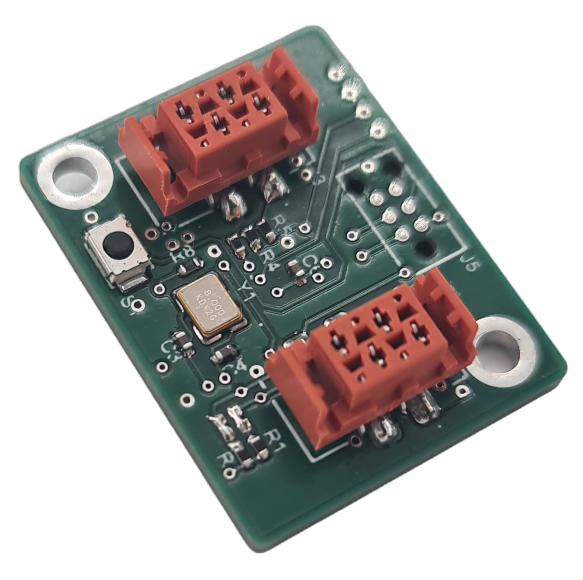

# Slave basic firmware

The basic firmware enables all the features of the I2C ecosystem to be used. To develop more specific firmware, you need to fork the source code. The link to the GitHub for the basic firmware is as follows: [slave basic firmware](https://github.com/I2C-Framework/slave_basic_firmware).

There are two methods of implementing the firmware on a printed circuit board using the STM32G071GBU6 microcontroller. The first method is to use the ST-LINK package and the Tag-Connect connector. The second method involves updating the firmware via I2C.

## Firmware implementation by I2C

Dans cette partie, il sera expliqué comment générer le fichier binaire du firmware. L'explication de la mise à jour du firmware via I2C est disponible dans la partie [master-tools.md](master-tools.md).

### Requirements

You need to install the Mbed Studio software: [Mbed Studio installation tutorial](mbed-studio-installation.md).
This compiles the source code and uploads it to the microcontroller.

### Generating the binary file

To generate the binary file, follow the steps below:

1. Open the project in Mbed Studio.
2. Compile the project.
3. Run the Python script `create_bin_file.py`.

The binary file will be generated at the root of the project under the name `slave_firmware.bin`. This file will contain the firmware with the necessary headers.

## Firmware implementation by ST-LINK

In this section, the implementation of firmware on a printed circuit board is explained using the ST-LINK box and the Tag-Connect connector.

### Requirements

#### Hardware

A ST-LINK box

A Tag-Connect connector

The printed circuit board using the STM32G071GBU6 microcontroller

#### Software

You need to install the Mbed Studio software: [Mbed Studio installation tutorial](mbed-studio-installation.md).
This compiles the source code and uploads it to the microcontroller.

### Implementation

To implement the firmware using the ST-LINK box and the Tag-Connect connector, follow the steps below:
1. Place the bootloader binary file at the root of the project with the name slave_bootloader.bin.
2. Open the project in Mbed Studio.
3. Compile the project.
4. Download the project to the microcontroller.

> Caution: This method deletes the bootloader metadata already present on the microcontroller.