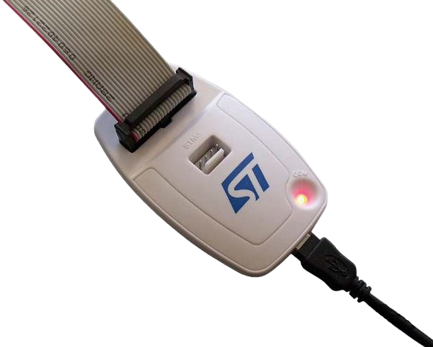
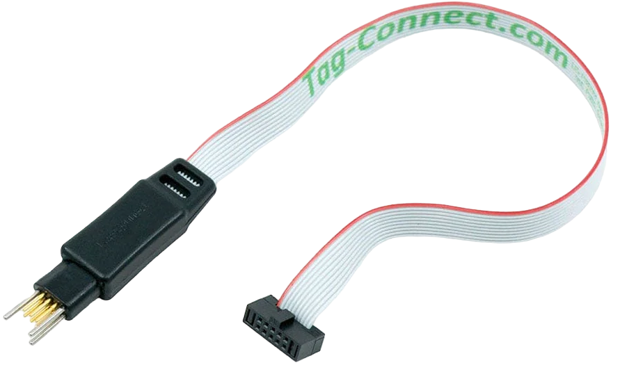
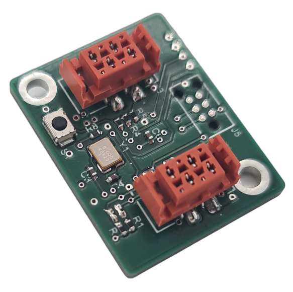
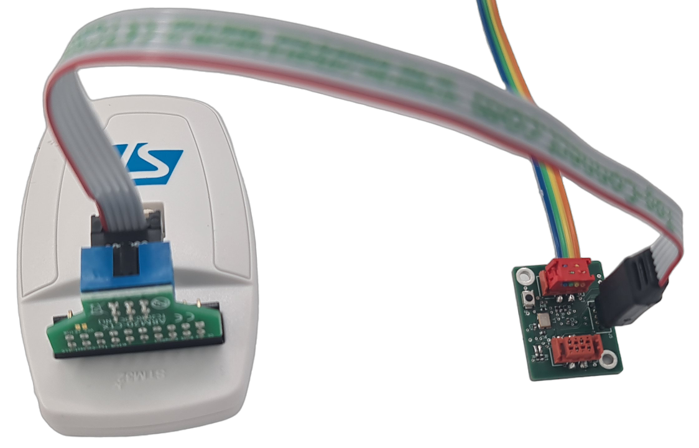

# Slave bootloader

The bootloader starts the microcontroller firmware and also enables the firmware to be updated via I2C communication.

## Requirements

### Hardware

A ST-LINK box

A Tag-Connect connector

The printed circuit board using the STM32G071GBU6 microcontroller

### Software

You need to install the Mbed Studio software: [Mbed Studio installation tutorial](mbed-studio-installation.md).
This compiles the source code and uploads it to the microcontroller.

## Implementation

### Hardware

To proceed with programming, please follow these steps:
* Connect the ST-Link box to the computer using the USB cable.
* Connect the Tag-Connect connector to the ST-Link box.
* Connect the Tag-Connect connector to the printed circuit board.
* Power the printed circuit board.

### Software

To begin with, you need to clone the [slave bootloader](https://github.com/I2C-Framework/slave_bootloader) Git repository.
Next, the project must be opened in Mbed Studio.
The source code must then be compiled and uploaded to the microcontroller.

## Warning

The bootloader is specifically designed to work with the STM32G071GBU6 microcontroller. However, it can be adapted to be compatible with other microcontrollers. In this case, it is important to check and control the memory addresses used in the bootloader source code and adapt them accordingly to match the specifications of the target microcontroller.